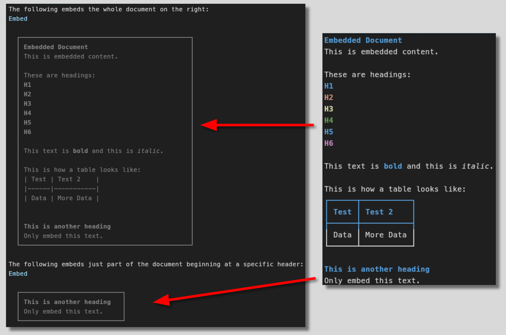

# markdown-embed.nvim
This plugin allows you to embed whole markdown files or parts of them into other markdown files using virtual lines in Neovim.



This is my first Neovim plugin, so expect some rough edges.

# Motivation
I believe the [DRY (Don't Repeat Yourself)](https://en.wikipedia.org/wiki/Don't_repeat_yourself) principle is a fundamentally good principle to follow. But not just for code, but also for notes.

If you have written something once, don't waste your time writing it again and don't copy it over, but embed it. Therefore, if you have to change something, you only change it once and it is updated everywhere.

# Installation
Install via Lazy:
```lua
{
   "kruegercharles/markdown-embed.nvim",
    config = function()
        require("markdown-embed").setup({
            -- The plugin will look for files relative to this path
            -- It should also work independent of that with files in the same folder
            base_path = '/path/to/your/markdown/files',
        })
    end
}
```

# Usage
## How to embed a file
I was inspired by the way Obsidian handles embeds, therefore the format for the embeds are: ``

The text within `[...]` is ignored. Write whatever you want in there or leave it empty.

After the file path you can optionally specify a heading with `#heading`.
If you do not specify a heading, the whole file is embedded.
If you specify a heading, everything below that heading is embedded until a heading of the same or a higher level is encountered.

## Update embeds
To update the embeds, run the command `:UpdateEmbeds`. This will update all embeds in the current buffer.

Also, embeds are automatically updated when you open or save a markdown file or when you resize the window.

# Known Limitations
If you use a plugin like [render-markdown.nvim](https://github.com/MeanderingProgrammer/render-markdown.nvim), the content of the embed will only partly be rendered.

Images like those rendered with [image.nvim](https://github.com/3rd/image.nvim) are not rendered at all.

If you know how to fix this, please open an issue and/or a pull request.

# Roadmap
- Render tables in embeds somehow
- Render checkboxes in embeds
- Render code blocks in embeds
- Render inline code in embeds
- Render URLs in embeds
- Render Latex in embeds
- Make plugin way more configurable
- Add health checks?
- Add shortcut to jump to the source of an embed
- FIX: When there is a ":" in the heading, the plugin fails to find the heading

# Future Work
In theory, the logic of this plugin can be used to embed pretty much every type of text file within a markdown file.

For example, you could embed parts of a python file in a markdown file.

I currently don't have the need for that, but if that is something that interests you, feel free to fork my plugin and/or create a pull request.
